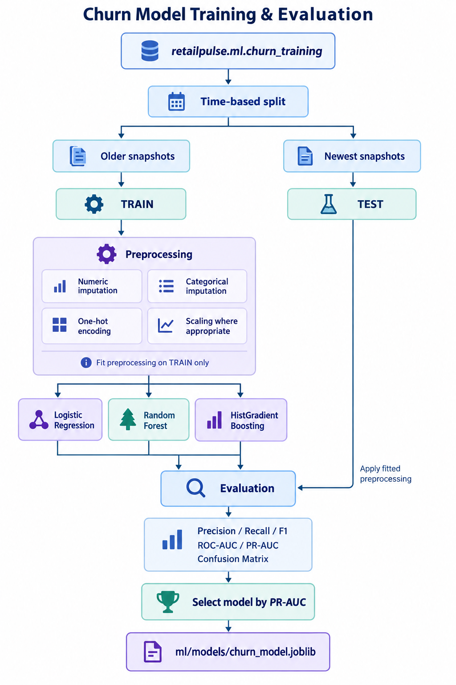
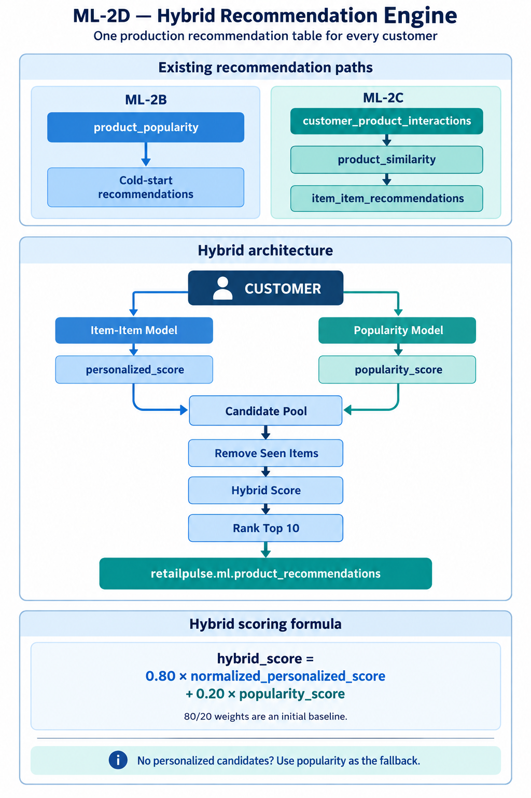
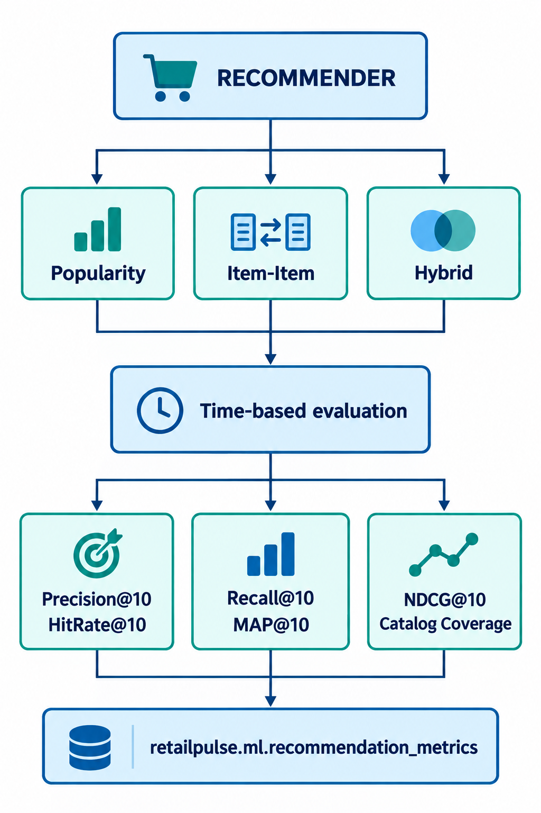

# RetailPulse AI

**Maintainer:** `bj_kush`

An end-to-end real-time data engineering, machine learning, and GenAI platform for e-commerce analytics.

## Start Docker containers step by step

Run these commands from the repository root using `docker-compose.yml`.
Each step adds containers without stopping the previous group.

### 1. Start ingestion

Starts PostgreSQL, Kafka, Debezium, MinIO, and topic/connector initialization.

```bash
docker compose --profile ingestion up -d --build
```

### 2. Start ETL

Starts Flink JobManager/TaskManager, Spark Iceberg, Spark Thrift, dbt, quality,
and shared source/storage dependencies.

```bash
docker compose --profile etl up -d --build
```

### 3. Start Airflow

Starts the Airflow database, migration, API server, scheduler, DAG processor,
and triggerer.

```bash
docker compose --profile airflow up -d --build
```

### 4. Start analytics

Starts Superset, its PostgreSQL database, Redis, and initialization.

```bash
docker compose --profile analytics up -d --build
```

### 5. Start Kafka UI

```bash
docker compose --profile tools up -d
```

### 6. Start the original Spark container (optional)

Needed only for older manual Spark jobs.

```bash
docker compose --profile legacy-spark up -d
```

### 7. Start ML and run churn training

Build and start the ML container:

```bash
docker compose up -d --build ml
docker compose ps ml
```

The container stays running with `sleep infinity`. It uses MinIO at
`minio:9000` and mounts `./ml` at `/opt/retailpulse/ml`.

With MinIO and `spark-iceberg` running and the
`retailpulse.ml.churn_training` table populated, export the training data:

```bash
docker compose exec spark-iceberg spark-submit /opt/retailpulse/ml/training/export_churn_training.py
```

This replaces the export at `s3://retailpulse/ml/exports/churn_training/`.
Train the churn models from that export:

```bash
docker compose exec ml python /opt/retailpulse/ml/training/train_churn_model.py
```

Models and metadata are saved in `ml/models/`; comparison metrics and test
predictions are saved in `ml/artifacts/` on the host through the bind mount.
Re-run the build/start command after changing `ml/requirements.txt` or
`ml/Dockerfile`. Python source edits are available immediately through the mount.

To open a shell or stop the ML container:

```bash
docker compose exec ml bash
docker compose stop ml
```

### 8. Check container status and memory

For complete churn, recommendation, evaluation, and MLflow workflows, see
[Machine learning](#machine-learning).

```bash
docker compose --profile "*" ps -a
docker stats --no-stream
```

Initialization containers should show **Exited (0)** after completing successfully.
Existing container names, networks, and data volumes are preserved.

Alternatively, start every group with one command:

```bash
docker compose --profile "*" up -d --build
```

Starting everything removes the memory savings of selective groups. These commands
start containers; trigger your Airflow DAG separately to run the pipeline.

### Stop all services at once

Run from the repository root after active pipeline runs finish:

```bash
docker compose --profile "*" stop
```

This stops services belonging to the current root Compose project, including all
optional profiles, while preserving containers, volumes, and data. It does not
stop containers from other Compose projects or containers started manually.

If you previously used the separate Airflow deployment, stop that project too:

```bash
docker compose -p airflow -f docker-compose.airflow.yml stop
```

Check which containers are still running and which Compose project owns them:

```bash
docker ps --format 'table {{.Names}}\t{{.Label "com.docker.compose.project"}}\t{{.Status}}'
```

You can stop any remaining project containers by their exact names:

```bash
docker stop <container-name-1> <container-name-2>
```

Replace the placeholders with names from `docker ps`. Only select containers you
intend to stop. If you want to stop **every running Docker container on this
machine**, including unrelated projects, use the command for your shell:

```powershell
# PowerShell
$runningContainers = @(docker ps -q)
if ($runningContainers.Count -gt 0) { docker stop $runningContainers }
```

```bash
# Git Bash / WSL / Linux
docker ps -q | xargs -r docker stop
```

Run `docker ps` again to verify that no containers remain running.

### Stop unused groups to reduce memory

For an existing full stack, finish active DAG runs, then switch to ingestion only:

```bash
docker compose --profile '*' stop
docker compose --profile ingestion up -d
```

Optional profiles: `analytics` starts Superset and its database/Redis;
`tools` starts Kafka UI and source dependencies; `legacy-spark` starts the original
plain Spark container and MinIO. Superset SQL queries require ETL's Spark Thrift.
The full end-to-end DAG requires ingestion, ETL, Airflow, and analytics:

```bash
docker compose --profile ingestion --profile etl --profile airflow --profile analytics up -d --build
```

`scripts/start_streaming.sh` enables these four profiles using the root Compose
file. Use that deployment instead of running the standalone Airflow Compose file
alongside it. Older bare `docker compose up` instructions below must now specify
profiles; commands targeting individual services still work.

To stop ETL while keeping ingestion running:

```bash
docker compose stop flink-jobmanager flink-taskmanager spark-iceberg spark-thrift dbt quality
docker compose --profile airflow stop
docker compose --profile analytics stop
docker compose stop kafka-ui spark
```

Use `stop` to retain data; do not use `down -v`. Restarting Flink containers alone
does not resubmit streaming jobs: run the streaming controller/end-to-end DAG when
resuming. Kafka backlog grows while ETL is stopped, subject to Kafka retention.
Airflow starts independently, but its DAGs need the corresponding service groups.

Memory savings come from stopping unused services. Flink retains its 4 GB process
budget because a smaller heap previously failed with the six-job workload.
Airflow now defaults to two concurrent tasks and one DAG parser. Optional root
`.env` overrides are `AIRFLOW_PARALLELISM=2`,
`AIRFLOW_MAX_ACTIVE_TASKS_PER_DAG=2`, and `AIRFLOW_PARSING_PROCESSES=1`.
These limit concurrency, not memory directly. Measure usage with
`docker stats --no-stream`.

## Local service URLs

These addresses use the host ports in `docker-compose.yml`.

| Service | Local URL | Purpose |
| --- | --- | --- |
| Airflow | [localhost:8090](http://localhost:8090) | DAGs, runs, task logs, and scheduling |
| MLflow | [localhost:5000](http://localhost:5000) | Experiments, artifacts, and churn model registry |
| Superset | [localhost:8088](http://localhost:8088) | Datasets, charts, SQL Lab, and dashboards |
| Kafka UI | [localhost:8080](http://localhost:8080) | Kafka topics, messages, and consumer groups |
| Flink | [localhost:8081](http://localhost:8081) | Streaming jobs, checkpoints, and task managers |
| Debezium / Kafka Connect | [localhost:8083](http://localhost:8083) | Connector REST API |
| Debezium connectors | [localhost:8083/connectors](http://localhost:8083/connectors) | Registered CDC connectors |
| MinIO console | [localhost:9001](http://localhost:9001) | Browse buckets and lakehouse files |
| MinIO S3 API | [localhost:9000](http://localhost:9000) | S3-compatible endpoint for storage clients |

### Health and status endpoints

| Service | Endpoint |
| --- | --- |
| Superset | [Health](http://localhost:8088/health) |
| Airflow | [Component health](http://localhost:8090/api/v2/monitor/health) |
| MinIO | [Live health](http://localhost:9000/minio/health/live) |
| Flink | [Cluster overview](http://localhost:8081/overview) |
| Debezium PostgreSQL connector | [Connector status](http://localhost:8083/connectors/retailpulse-postgres-connector/status) |

### Superset dashboards

These links refer to the dashboards created in the current local Superset database.
IDs can change if dashboards are recreated or imported into another installation.

| Dashboard | Local link |
| --- | --- |
| Executive Overview | [Open dashboard](http://localhost:8088/superset/dashboard/3/) |
| Sales & Revenue | [Open dashboard](http://localhost:8088/superset/dashboard/4/) |
| Customer 360 | [Open dashboard](http://localhost:8088/superset/dashboard/5/) |
| Product Performance | [Open dashboard](http://localhost:8088/superset/dashboard/6/) |
| Payment Reconciliation | [Open dashboard](http://localhost:8088/superset/dashboard/7/) |
| Marketing & Support | [Open dashboard](http://localhost:8088/superset/dashboard/8/) |

### Database and messaging connections

These are client connection addresses, not browser pages.

| Service | Host address | Usage |
| --- | --- | --- |
| PostgreSQL | `localhost:5432` | SQL clients; credentials and database name are in the root `.env` |
| Kafka host listener | `localhost:9094` | Bootstrap address for applications running on your computer |
| Kafka internal listener | `localhost:9092` | Published port, but advertises `kafka:9092`; use port 9094 for host clients |
| Spark Thrift | `localhost:10000` | Hive-compatible SQL clients; SQLAlchemy URI: `hive://superset@localhost:10000/analytics` |

Inside Docker containers, use service names instead of `localhost`, for example
`http://superset:8088`, `http://minio:9000`, `kafka:9092`, and
`hive://superset@spark-thrift:10000/analytics`. Airflow listens on port 8080
inside its container and is exposed on host port 8090.

### Query Iceberg with Beeline

With Spark Thrift running, connect from Bash or Git Bash:

```bash
MSYS_NO_PATHCONV=1 docker exec -it retailpulse-spark-thrift \
  /opt/spark/bin/beeline \
  -u 'jdbc:hive2://localhost:10000/'
```

At the Beeline prompt, list the namespaces in the RetailPulse catalog:

```sql
SHOW NAMESPACES IN retailpulse;
```

After running `ml/recommendation/training/build_product_similarity.py`,
check the saved similarity row count:

```sql
SELECT COUNT(*) AS similarity_rows
FROM retailpulse.ml.product_similarity;
```

Preview 10 saved similarity records, ordered by source product and rank:

```sql
SELECT *
FROM retailpulse.ml.product_similarity
ORDER BY source_product_id, similarity_rank
LIMIT 10;
```

Enter SQL directly in Beeline, without Python wrappers such as
`spark.sql(...).show()`. The `LIMIT 10` clause only limits the displayed
results; it does not change the saved table.

Exit Beeline with:

```text
!quit
```

`MSYS_NO_PATHCONV=1` prevents Git Bash from converting the container's
`/opt/spark/bin/beeline` path into a Windows path.

## Machine learning

The ML layer supports customer churn prediction and product recommendation.
Spark builds features and Iceberg tables; the `ml` container runs pandas,
scikit-learn, and MLflow clients against Parquet exports in MinIO.

### ML setup

Run from the repository root after populating the lakehouse Silver and dbt
analytics tables. Starting services does not populate tables or run ML jobs.

```bash
docker compose up -d --build minio spark-iceberg mlflow ml
docker compose ps minio spark-iceberg mlflow mlflow-db ml
```

MLflow runs at [localhost:5000](http://localhost:5000), with PostgreSQL for
tracking metadata and MinIO for artifacts. Containers use `http://mlflow:5000`
and `minio:9000`. The `retailpulse` bucket must already exist.

Commands below work in PowerShell or Bash. In Git Bash, first run
`export MSYS_NO_PATHCONV=1` to preserve container paths. Run each sequence in
order and wait for each job to succeed.

The shared `./ml` mount exposes source edits and generated artifacts on the host.
Rebuild `ml` after changing [requirements](ml/requirements.txt) or its
[Dockerfile](ml/Dockerfile). Dependencies include pandas, NumPy, scikit-learn,
joblib, PyArrow, MinIO, boto3, MLflow, and psycopg2.

### Churn training

Training uses historical customer observation dates, 30/90/180-day feature
windows, and a 60-day future label: no orders in the next 60 days means
`churned = 1`. Sources are `retailpulse.analytics.dim_customer` and Silver
`orders`, `payments`, `website_events`, `support_tickets`, and `marketing_events`.

```bash
docker compose exec spark-iceberg spark-submit /opt/retailpulse/ml/monitoring/validate_churn_sources.py
docker compose exec spark-iceberg spark-submit /opt/retailpulse/ml/features/build_churn_training_set.py
docker compose exec spark-iceberg spark-submit /opt/retailpulse/ml/training/export_churn_training.py
docker compose exec ml python /opt/retailpulse/ml/training/train_churn_mlflow.py
docker compose exec ml python /opt/retailpulse/ml/training/test_registry_model.py
```

The MLflow trainer compares logistic regression, random forest, and histogram
gradient boosting using a time-based split. Results are sorted by PR-AUC,
ROC-AUC, then F1. It logs runs under `retailpulse-churn`, registers the selected
model as `RetailPulseChurnModel`, and updates its `champion` alias. Retraining
can therefore change the model used by subsequent inference.

For local artifact-only training, use:

```bash
docker compose exec ml python /opt/retailpulse/ml/training/train_churn_model.py
```

This saves a local joblib model but does not establish the registry champion
required by the inference pipeline.

The separate general customer feature builder uses analytics `dim_customer`,
`fact_orders`, `fact_payments`, and `fact_customer_activity`:

```bash
docker compose exec spark-iceberg spark-submit /opt/retailpulse/ml/features/build_customer_features.py
```

It writes `retailpulse.ml.customer_features`. Historical churn training builds
its own snapshots from source tables and does not require this separate job.



### Churn scoring and monitoring

After registering a champion, build current features and score customers:

```bash
docker compose exec spark-iceberg spark-submit /opt/retailpulse/ml/features/build_churn_scoring_features.py
docker compose exec spark-iceberg spark-submit /opt/retailpulse/ml/inference/export_churn_scoring_features.py
docker compose exec ml python /opt/retailpulse/ml/inference/predict_churn.py
docker compose exec spark-iceberg spark-submit /opt/retailpulse/ml/inference/load_churn_predictions.py
docker compose exec spark-iceberg spark-submit /opt/retailpulse/ml/monitoring/validate_churn_predictions.py
docker compose exec spark-iceberg spark-submit /opt/retailpulse/ml/monitoring/monitor_churn_predictions.py
```

Inference loads `models:/RetailPulseChurnModel@champion` and produces churn
probabilities, risk bands, revenue-at-risk estimates, and model metadata.
Monitoring appends history to `retailpulse.ml.churn_monitoring`: prediction
coverage, probability ranges, risk-band counts, duplicate customers, model
version, revenue at risk, and validation errors. These checks measure scoring
health; future outcome labels are needed to measure live accuracy.

The manual Airflow DAG
[`retailpulse_churn_pipeline`](airflow/dags/ml/retailpulse_churn_pipeline.py)
performs source and MLflow validation, feature generation/export, champion
validation, inference, loading, prediction validation, and monitoring:

```bash
docker compose --profile airflow up -d --build
docker compose exec airflow-scheduler airflow dags list-import-errors
docker compose exec airflow-scheduler airflow dags trigger retailpulse_churn_pipeline
```

It has `schedule=None`, permits one active run, and does not retrain models.
Keep Spark, ML, MinIO, and MLflow running and register the champion first.
Its [control module](airflow/include/retailpulse/ml/churn_control.py) uses Docker
to execute jobs in the existing containers, so Airflow needs Docker access and
network access to MLflow.

### Product recommendations

The interaction builder combines purchases and product views from Silver
`orders`, `order_items`, `website_events`, and `products`. Default purchase and
view weights are 5.0 and 1.0 respectively.

Build features and rankings, then generate recommendations:

```bash
docker compose exec spark-iceberg spark-submit /opt/retailpulse/ml/recommendation/features/build_customer_product_interactions.py
docker compose exec spark-iceberg spark-submit /opt/retailpulse/ml/recommendation/training/build_product_popularity.py
docker compose exec spark-iceberg spark-submit /opt/retailpulse/ml/recommendation/training/build_product_similarity.py
docker compose exec spark-iceberg spark-submit /opt/retailpulse/ml/recommendation/inference/build_item_item_recommendations.py
docker compose exec spark-iceberg spark-submit /opt/retailpulse/ml/recommendation/inference/build_cold_start_recommendations.py
docker compose exec spark-iceberg spark-submit /opt/retailpulse/ml/recommendation/inference/build_hybrid_recommendations.py
```

| Approach | Behavior |
| --- | --- |
| Popularity | Global product ranking from interactions; supplies baseline and fallback candidates. |
| Item-item | Customer co-interactions and cosine similarity; also stores Jaccard similarity. Keeps up to 50 neighbors per source product and generates Top-10 unseen recommendations. |
| Cold start | Popularity recommendations for customers without interaction history, using analytics `dim_customer`. |
| Hybrid | Combines personalized and popularity scores with configured 80/20 weights, plus fallback candidates, to generate final product recommendations. |

Similarity defaults require at least two customers per product and two
co-interacting customers per pair. Hybrid also needs the customer dimension and
product catalog. The standalone cold-start table is available independently.



### Recommendation evaluation and MLflow tracking

After building customer-product interactions, run:

```bash
docker compose exec spark-iceberg spark-submit /opt/retailpulse/ml/recommendation/evaluation/build_evaluation_dataset.py
docker compose exec spark-iceberg spark-submit /opt/retailpulse/ml/recommendation/evaluation/build_evaluation_recommendations.py
docker compose exec spark-iceberg spark-submit /opt/retailpulse/ml/recommendation/evaluation/evaluate_recommendations.py
docker compose exec spark-iceberg spark-submit /opt/retailpulse/ml/recommendation/evaluation/export_recommendation_metrics.py
docker compose exec ml python /opt/retailpulse/ml/recommendation/training/log_recommendation_experiments.py
```

The dataset splits aggregated customer-product rows by `last_interaction_at`,
using a cutoff 30 days before the latest interaction date. Eligible customers
need at least two historical products and future interactions; seen products are
excluded from test targets. This is a holdout over aggregated pairs, rather than
a reconstruction of individual events at the cutoff.

The evaluation builder computes popularity and similarity from TRAIN rows and
emits `popularity`, `item_item`, and `hybrid_80_20` predictions for TEST customers.
It builds these separately from production similarity and recommendation tables.
Its candidate and similarity rules differ from the production builders, so
treat the results as evaluation baselines.

| Metric | Current calculation |
| --- | --- |
| Precision@10 | Hits divided by the number of recommendations actually returned. |
| Recall@10 | Hits divided by the customer's distinct test products. |
| HitRate@10 | Whether a customer has a hit, averaged across customers. |
| MAP@10 | Mean average precision, normalized by `min(test products, K)`. |
| NDCG@10 | Discounted hit gain divided by ideal gain at K. |
| Catalog Coverage | Distinct recommended products divided by the Silver product catalog size. |

Customer metrics average over customers with predictions and matching test
targets. Customers with no predictions are absent from those averages; compare
`evaluated_customers` alongside the metric scores.

The exporter overwrites the metrics Parquet export in MinIO. The logger creates
one MLflow run per model in `retailpulse-recommendation`, with configuration,
metrics, and metadata. It also saves local metadata JSON files and a comparison
CSV. It **does not register a recommendation model or select a champion**;
the recommendation registry constants in `ml_config.py` are not used by this
logger. Re-running it creates new experiment runs.



### ML outputs and configuration

All tables below belong to the `retailpulse.ml` namespace.

| Stage | Iceberg tables |
| --- | --- |
| Churn features and labels | `customer_features`, `churn_training`, `churn_scoring_features` |
| Churn scoring and monitoring | `churn_predictions`, `churn_monitoring` |
| Recommendation features and training | `customer_product_interactions`, `product_popularity`, `product_similarity` |
| Recommendation inference | `item_item_recommendations`, `cold_start_recommendations`, `product_recommendations` |
| Recommendation evaluation | `recommendation_evaluation`, `recommendation_eval_predictions`, `recommendation_metrics` |

| Storage location | Contents |
| --- | --- |
| `s3://retailpulse/ml/exports/churn_training/` | Training Parquet export. |
| `s3://retailpulse/ml/exports/churn_scoring_features/` | Scoring Parquet export. |
| `s3://retailpulse/ml/predictions/churn/` | Inference output including `churn_predictions.parquet`. |
| `s3://retailpulse/ml/exports/recommendation_metrics/` | Recommendation metrics Parquet export. |
| `s3://retailpulse/mlflow-artifacts/` | MLflow artifacts. |
| `ml/models/` | Local churn model and metadata. |
| `ml/artifacts/` | Churn comparisons, test predictions, and per-model reports. |
| `ml/artifacts/recommendation/` | Per-model metadata JSON and `recommendation_experiment_summary.csv`. |

Most builders replace their output tables; exports overwrite their prefixes.
Churn monitoring appends history. Preserve results you need before rerunning a
builder; MLflow retains experiments that have been logged.

[ml/common/ml_config.py](ml/common/ml_config.py) contains table names, feature
windows, churn horizon, weights, neighbor limits, and evaluation settings.
Some scripts also have local constants: evaluation hybrid weights and popularity
candidate limits, cold-start Top-N, and recommendation logging configuration.
The evaluator's column names and logger currently assume K=10; changing only
`RECOMMENDATION_EVAL_TOP_K` does not update those labels or logging metadata.

Runtime settings include `MINIO_ENDPOINT`, `MINIO_BUCKET`, `MLFLOW_TRACKING_URI`,
and churn's `MLFLOW_EXPERIMENT_NAME`. Recommendation logging uses
`RECOMMENDATION_MLFLOW_EXPERIMENT`. Churn inference accepts
`MLFLOW_REGISTERED_MODEL_NAME` and `MLFLOW_MODEL_ALIAS`. Pass overrides with
`docker compose exec -e NAME=value ...`.

The evaluation recommendation builder uses 200 shuffle partitions, disables
adaptive partition coalescing for that job, and persists reused intermediates on
disk. Override its partition count when needed:

```bash
docker compose exec -e RECOMMENDATION_EVAL_SHUFFLE_PARTITIONS=400 spark-iceberg spark-submit /opt/retailpulse/ml/recommendation/evaluation/build_evaluation_recommendations.py
```

For repeated memory allocation warnings, inspect Spark stage progress and
`docker stats --no-stream`. The shared session uses `local[*]`, so tasks share a
local JVM; disk persistence also requires free container disk space. Run large
ML Spark jobs sequentially when the local stack is memory constrained.

Validate completed pipeline outputs in Beeline:

```sql
SELECT COUNT(*) AS customers FROM retailpulse.ml.churn_predictions;
SELECT * FROM retailpulse.ml.churn_monitoring ORDER BY monitored_at DESC LIMIT 10;
SELECT * FROM retailpulse.ml.recommendation_metrics ORDER BY ndcg_at_10 DESC;
SELECT customer_id, COUNT(*) AS recommendations
FROM retailpulse.ml.product_recommendations
GROUP BY customer_id
LIMIT 10;
```

For missing Iceberg tables, complete the upstream Silver/dbt pipeline and the
preceding ML builder. For missing Parquet exports, run the matching Spark export
before the ML Python script. For a missing churn champion, run MLflow training
and the registry smoke check before inference.

## Architecture

PostgreSQL
    ↓
Debezium CDC
    ↓
Kafka
    ↓
Flink / PySpark
    ↓
MinIO / Apache Iceberg
    ↓
dbt
    ↓
Analytical Warehouse
    ↓
Superset / Grafana
    ↓
GenAI AI Analyst

## Pipeline organization

- `spark/jobs/batch/` — bounded Spark jobs, grouped into Bronze, Silver, and Gold.
- `flink/jobs/streaming/` — continuous Flink jobs, grouped into Bronze, Silver, and Gold.
- `docs/architecture/pipelines.md` — pipeline ownership and run commands.
- `airflow/README_PHASE1.md` — Airflow setup, DAGs, control-plane commands,
  and troubleshooting.

## Technologies

- Python
- PostgreSQL
- Apache Kafka
- Debezium
- Apache Flink
- Apache Spark / PySpark
- Apache Iceberg
- MinIO
- dbt
- Apache Airflow
- Apache Superset
- Grafana
- Prometheus
- Docker
- Machine Learning: scikit-learn, pandas, NumPy, joblib, and MLflow
- RAG
- LLM
- FastAPI

## Project Goals

1. Build a batch data pipeline.
2. Build a CDC pipeline.
3. Build real-time streaming pipelines.
4. Build a lakehouse.
5. Build an analytics warehouse.
6. Implement data quality.
7. Build ML pipelines.
8. Build a GenAI analytics assistant.
9. Implement monitoring.
10. Deploy the platform using containers.

## Source data generation

PostgreSQL
    ↓
E-commerce source tables
    ↓
Python data generator
    ↓
Realistic transactional data

The repository now also includes CDC ingestion, streaming and batch processing,
Iceberg tables, dbt analytics, data quality, dashboards, churn training and
scoring, and recommendation generation and evaluation. Churn scoring has a
manual Airflow DAG; recommendation jobs use the manual sequence documented above.
GenAI remains a project goal.

## Docker commands from Git Bash on Windows

Git Bash/MSYS automatically converts arguments that begin with `/` into Windows
paths. That breaks `docker exec` when the command or file path exists only
inside a Linux container. Use a double leading slash for container paths;
Docker normalizes it to a single slash:

```bash
# Kafka
docker exec retailpulse-kafka //opt/kafka/bin/kafka-topics.sh --bootstrap-server localhost:9092 --list

# Flink
docker compose up -d --build flink-jobmanager flink-taskmanager
docker exec retailpulse-flink-jobmanager sh -lc 'flink run -py /opt/flink/jobs/streaming/bronze/retailpulse_bronze.py'
```

This avoids needing `MSYS_NO_PATHCONV=1` while preserving the normal single-slash
Linux path inside the container. Use normal relative paths such as
`./flink/jobs` for host-side paths in `docker compose` commands and Compose
files.

## Complete runbook: first command to final validation

The following is the complete local-development sequence used for this
project. Commands below are written for Git Bash unless marked PowerShell.

### 1. Enter the project and activate Python

```bash
cd ~/projects/retailpulse-ai
source .venv/Scripts/activate
```

The virtual environment is kept in place; do not delete it. For PowerShell,
use `\.venv\Scripts\Activate.ps1` instead.

### 2. Start the core platform

```bash
docker compose up -d --build
docker compose ps
```

The core stack starts PostgreSQL, MinIO, Kafka, Debezium, the Flink
JobManager/TaskManager, Kafka UI, and the topic initializer. Check Kafka topics
when needed:

```bash
docker exec retailpulse-kafka //opt/kafka/bin/kafka-topics.sh \
  --bootstrap-server localhost:9092 --list
```

### 3. Submit the streaming Bronze job (optional manual start)

```bash
docker exec retailpulse-flink-jobmanager sh -lc \
  'flink run -py //opt/flink/jobs/streaming/bronze/retailpulse_bronze.py'
```

Check the Flink UI at http://localhost:8081. The `jdk.compiler` export messages
printed by Flink are warnings and can be ignored.

### 4. Run bounded Spark batch processing

Run these from the repository root in PowerShell:

```powershell
& .\.venv\Scripts\python.exe -m spark.jobs.batch.bronze.postgres_to_bronze
& .\.venv\Scripts\python.exe -m spark.jobs.batch.silver.bronze_to_silver
& .\.venv\Scripts\python.exe -m spark.jobs.batch.gold.silver_to_gold
```

Use PowerShell for native Windows PySpark. If Spark reports `WinError 2`,
verify Java and `JAVA_HOME`; if it cannot infer a Parquet schema, verify that
the expected Bronze prefix contains Parquet files.

### 5. Configure and start Airflow

```bash
cd ~/projects/retailpulse-ai/airflow
cp .env.example .env            # first run only
docker compose --env-file .env -f docker-compose.airflow.yml up airflow-init
docker compose --env-file .env -f docker-compose.airflow.yml \
  up -d --build --force-recreate
docker compose --env-file .env -f docker-compose.airflow.yml ps
```

Open the Airflow UI at http://localhost:8090. The Airflow 3 task execution URL
must be `http://airflow-apiserver:8080/execution/`; the shared JWT secret and
issuer are configured in `airflow/docker-compose.airflow.yml`.

### 6. Validate and trigger Airflow DAGs

```bash
docker compose --env-file .env -f docker-compose.airflow.yml exec \
  airflow-scheduler airflow dags list-import-errors

docker compose --env-file .env -f docker-compose.airflow.yml exec \
  airflow-scheduler airflow dags list

docker compose --env-file .env -f docker-compose.airflow.yml exec \
  airflow-scheduler airflow dags trigger retailpulse_platform_health

docker compose --env-file .env -f docker-compose.airflow.yml exec \
  airflow-scheduler airflow dags trigger retailpulse_streaming_controller
```

Run `retailpulse_platform_health` first. The streaming controller starts the
registered Flink jobs, waits for Customer 360 checkpoint completion, and then
checks MinIO output.

### 7. Inspect jobs, checkpoints, and outputs

```bash
docker exec retailpulse-flink-jobmanager flink list -r
docker exec retailpulse-flink-jobmanager sh -lc \
  'python3 -m py_compile //opt/flink/jobs/streaming/gold/retailpulse_streaming_gold_customer360_recovery.py'
docker compose --env-file .env -f docker-compose.airflow.yml logs --tail 150 \
  airflow-scheduler airflow-apiserver
```

To submit Customer 360 manually for a Flink-only test, use the same explicit
pipeline name used by Airflow:

```bash
docker exec retailpulse-flink-jobmanager sh -lc \
  "flink run -d -D 'pipeline.name=RetailPulse - Customer 360 Stateful Recovery' -py //opt/flink/jobs/streaming/gold/retailpulse_streaming_gold_customer360_recovery.py"
```

Expected MinIO prefixes are:

```text
s3://retailpulse/bronze/
s3://retailpulse/silver_stream/
s3://retailpulse/gold_stream/
s3://retailpulse/gold_stream/customer_360_recovery/
s3://retailpulse/flink-checkpoints/customer360-recovery/
```

If a task stops after `Pre Execute`, recreate Airflow with `--force-recreate`.
If Customer 360 reports `Flink job not found`, cancel an obsolete autogenerated
`insert-into_*` Customer 360 job and trigger the controller again. The expected
Flink name is `RetailPulse - Customer 360 Stateful Recovery`.

For the Airflow-specific architecture and troubleshooting guide, see
[`airflow/README_PHASE1.md`](airflow/README_PHASE1.md). For pipeline ownership,
see [`docs/architecture/pipelines.md`](docs/architecture/pipelines.md).


# RetailPulse Data Quality Phase

To initialize streaming through dbt with one command from Git Bash:

```bash
bash scripts/start_streaming.sh
```

This starts the containers, installs the Airflow setup dependencies, pauses the
separate streaming/Iceberg/dbt workflows, and triggers
`retailpulse_streaming_end_to_end`. If another pipeline run is still active,
the script stops before recreating services; let that run finish and retry.
Follow the run at [Airflow](http://localhost:8090).

The manual DAG creates missing PostgreSQL schemas/tables, seeds a small demo
dataset only when all source tables are empty, ensures the MinIO bucket and
Debezium connector, starts or reuses the six Flink jobs, waits for checkpoints
and committed Bronze Parquet for all nine entities, initializes missing Iceberg
Bronze tables, merges CDC into Iceberg Silver, validates Silver, and runs dbt
debug, build (models and tests), and docs generation. Existing Bronze Iceberg
tables are retained; ongoing Silver updates read streaming files directly.
Flink remains running after the DAG succeeds.

The six Flink jobs share a TaskManager configured with a 4 GB process budget
and 2 GB task heap. The previous 512 MB heap ran out of memory while replaying
the existing CDC data. The startup script applies this configuration.

For subsequent runs, trigger **retailpulse_streaming_end_to_end** in Airflow.
Keep the separate pipeline DAGs paused while it runs. The standalone incremental
Iceberg DAG is now manual to avoid independent five-minute writes overlapping
this workflow. A fresh start here means
initializing missing resources, not deleting Kafka offsets, Flink state, or data.
If Kafka history has expired and a previously snapshotted connector has no new
events, another source snapshot/replay is needed; the file sensor will not
pretend an empty source is ready.

1. The `quality` service is already included in `docker-compose.yml`.
2. Build/start:
   docker compose build quality
   docker compose up -d --no-deps --force-recreate quality
3. Check GX:
   docker exec retailpulse-quality python3 -c "import great_expectations as gx; print(gx.__version__)"
4. Run freshness:
   docker exec retailpulse-quality spark-submit /opt/retailpulse/quality/check_freshness.py
5. Run GX:
   docker exec retailpulse-quality spark-submit /opt/retailpulse/quality/validate_analytics.py
6. Restart Airflow and trigger `retailpulse_data_quality`.

Results are written to:
- quality/results/*.json
- retailpulse.control.data_quality_results

Note: if you are not generating CDC continuously, the 30-minute freshness check can fail.
Increase MAX_AGE_MINUTES during static development.

If freshness fails with `ClassNotFoundException: IcebergSparkSessionExtensions`
or `Cannot find catalog plugin class`, rebuild and recreate `quality` using step 2
(with the rest of the stack running). The quality image uses Spark 4.0.1 to match
the shared Iceberg runtime and loads Iceberg and Hadoop AWS dependencies through
`spark-defaults.conf` at startup. Setting `spark.jars.packages` only inside the
Python session builder is too late to resolve them when launched by `spark-submit`.

If freshness reports `TABLE_OR_VIEW_NOT_FOUND` for `retailpulse.silver.customers`,
the Iceberg Silver tables are not visible in the configured warehouse. Both
`quality` and `spark-iceberg` must use the same `ICEBERG_WAREHOUSE` and
`MINIO_S3A_ENDPOINT` (the Compose defaults already match).
For an uninitialized lakehouse, run the `retailpulse_iceberg_pipeline` Airflow DAG
after the streaming Bronze source files are available. Its bootstrap step
replaces Bronze Iceberg tables from the source files, so use it for initialization.
If Bronze Iceberg tables already exist and only Silver is missing, run:

```bash
docker exec retailpulse-spark-iceberg spark-submit /opt/retailpulse/lakehouse/iceberg/jobs/build_silver_current_state.py
docker exec retailpulse-spark-iceberg spark-submit /opt/retailpulse/lakehouse/iceberg/jobs/validate_silver.py
docker exec retailpulse-quality spark-submit /opt/retailpulse/quality/check_freshness.py
```

Raw Parquet files in MinIO do not by themselves create these Iceberg catalog
tables. The freshness check reports missing tables as failures; it does not
create them. Quality Python changes are bind-mounted, so no image rebuild is
needed for the improved diagnostics.
