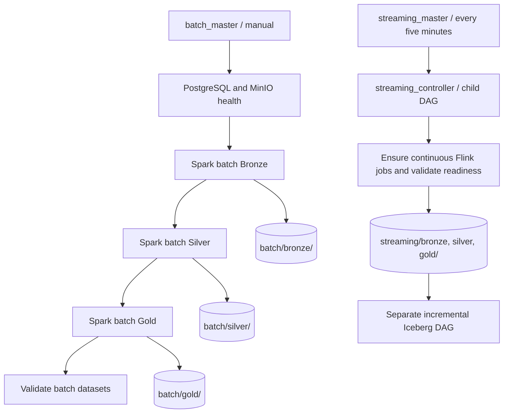

# Separate batch and streaming parent DAGs

## Entry points

For initial setup through dbt, run `bash scripts/start_streaming.sh` from the
repository root, or trigger the manual `retailpulse_streaming_end_to_end` DAG
after deployment. It owns source initialization, Flink readiness, Iceberg
initialization/CDC merge, Silver validation, and dbt build/tests/docs. The setup
script pauses the separate streaming/Iceberg/dbt DAGs to prevent overlapping
writers. Those DAGs remain available for independent operation after this run.

| Parent DAG | Schedule | Work |
|---|---|---|
| `retailpulse_batch_master` | Manual | PostgreSQL/MinIO health → Spark Bronze → Silver → Gold → output validation |
| `retailpulse_streaming_master` | Every five minutes | Trigger `retailpulse_streaming_controller`, wait for readiness/checkpoint/output validation |

Batch jobs terminate after each stage. Flink jobs remain running after the streaming controller succeeds. The streaming child is now unscheduled, so only the parent owns its recurring trigger. Unpause both the streaming parent and child when using that pair independently; a paused child cannot execute. The pinned provider does not support `fail_when_dag_is_paused` on Airflow 3. A child failure fails the waiting parent. Parent runs do not overlap themselves.

Iceberg incremental processing, maintenance, platform health and the manual dbt DAG remain separate workflows. Iceberg readers now consume the streaming area exclusively. Batch snapshots do not feed the CDC MERGE job.



## Bucket layout

```text
s3://retailpulse/
  batch/
    bronze/<entity>/
    silver/<entity>/
    gold/{customer_360,product_performance,order_summary}/
  streaming/
    bronze/<entity>/
    silver/<entity>/
    gold/{order_summary,order_payment_summary,product_performance,customer_360_recovery}/
  warehouse/                     Existing Iceberg warehouse
  flink-checkpoints/             Existing recovery state
  flink-savepoints/              Existing recovery state
```

MinIO prefixes appear when jobs first write objects; no empty directory creation is required. Each batch run replaces its batch snapshots, while Flink continues writing streaming files. Existing objects at the old paths are not deleted or moved by this change.

## Install and verify

From the repository root:

```powershell
docker compose build spark-iceberg
docker compose up -d --no-deps --force-recreate spark-iceberg
docker compose exec spark-iceberg python3 -c "from dotenv import load_dotenv; print('python-dotenv OK')"
docker compose --env-file airflow/.env -f airflow/docker-compose.airflow.yml up -d --build
docker compose --env-file airflow/.env -f airflow/docker-compose.airflow.yml exec airflow-scheduler airflow dags list-import-errors
docker compose --env-file airflow/.env -f airflow/docker-compose.airflow.yml exec airflow-scheduler airflow dags unpause retailpulse_streaming_controller
docker compose --env-file airflow/.env -f airflow/docker-compose.airflow.yml exec airflow-scheduler airflow dags unpause retailpulse_batch_master
docker compose --env-file airflow/.env -f airflow/docker-compose.airflow.yml exec airflow-scheduler airflow dags trigger retailpulse_batch_master
```

The Spark image now includes python-dotenv for the existing configuration module. Batch submission supplies container DNS addresses and credentials from Airflow configuration, sets the project working directory/PYTHONPATH, and uses the existing PostgreSQL JDBC jar. Hadoop AWS defaults to 3.4.1 to match the Spark image. The standard Airflow provider is explicitly pinned for the parent trigger operator.

## Existing streaming deployment: cutover before enabling the parent

If batch reports `ClassNotFoundException: org.postgresql.Driver`, use the updated
`batch_control.py`, which supplies the JDBC jar through both `--driver-class-path`
and `--jars` before the Spark JVM starts. The jar is mounted at
`/opt/retailpulse/spark/jars/postgresql-42.7.12.jar`. Clear the failed batch task
after updating the mounted files; this classpath fix does not require an image
rebuild. Setting `spark.jars` only inside the Python session builder is insufficient
for this observed driver class-loading failure.

If batch fails with `ModuleNotFoundError: No module named 'dotenv'`, rebuild and
recreate `spark-iceberg` using the commands above, then verify the import before
clearing the failed batch task. Updating mounted Python files does not install
image dependencies. Restarting the existing container alone does not apply a
rebuilt image. Recreate the Spark container when no other Spark job is running.

1. Pause the streaming parent (if already enabled), streaming controller, and incremental Iceberg DAG during cutover. Wait for any active controller run to finish.
2. Take and verify appropriate Flink savepoints before replacing running jobs. A running job retains its old sink configuration even though the mounted Python source has changed; `ensure_flink_job` deliberately reuses healthy jobs.
3. Stop the old registered jobs in a controlled manner and resubmit using the new code. Recovery prefixes and operator identities are unchanged. Confirm restored FileSink pending state has committed and new output goes to `streaming/`; changing sink paths is not itself a migration of checkpointed pending files.
4. Preserve old Bronze CDC history. If a new bootstrap/full replay is needed, copy finalized CDC Parquet into the new streaming Bronze area using unique object keys and validate schemas/counts first. Do not copy old JDBC snapshot files into the CDC area. Existing Silver/watermarks are retained for continuation; a full rebuild needs a deliberate consistent bootstrap/watermark reset.
5. Confirm new finalized objects exist under all expected streaming prefixes and the Customer 360 checkpoint check succeeds. Then unpause `retailpulse_streaming_controller`, `retailpulse_streaming_master`, and the incremental Iceberg DAG.

No live job cancellation, object migration, or bucket mutation is performed by editing these files. After cutover, use the Airflow UI at port 8090 to trigger either parent independently and the MinIO console at port 9001 to inspect its output area.

The parent uses the standard provider's [TriggerDagRunOperator](https://airflow.apache.org/docs/apache-airflow-providers-standard/1.13.0/_api/airflow/providers/standard/operators/trigger_dagrun/index.html) with completion waiting and deferred polling.
