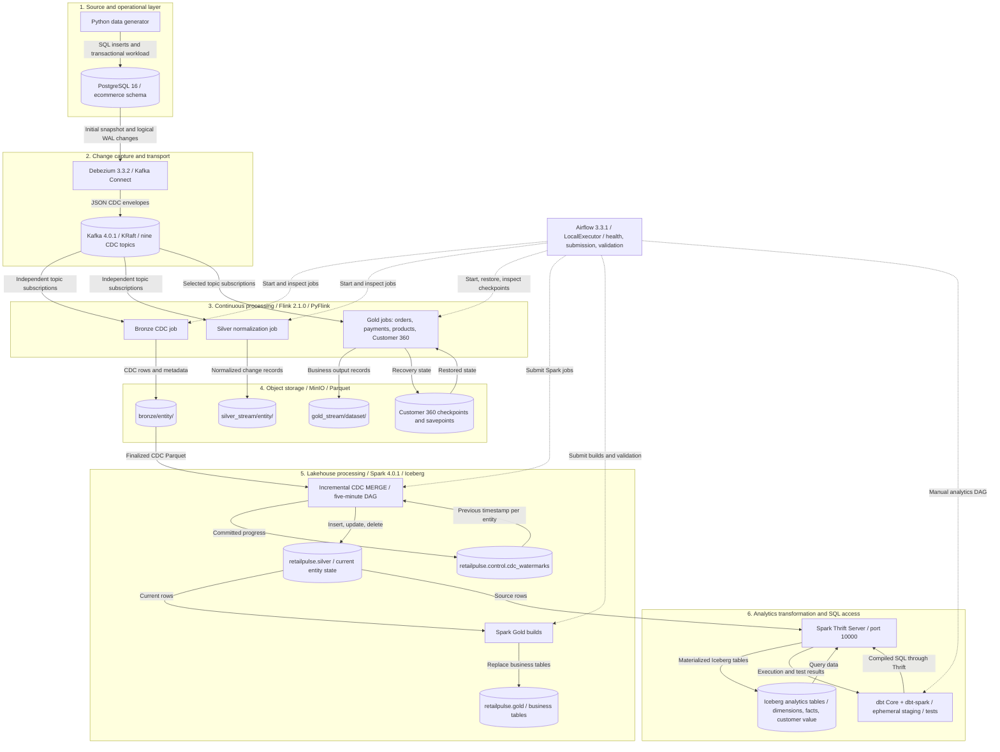
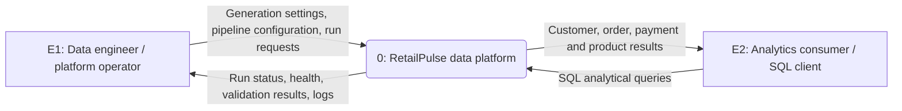
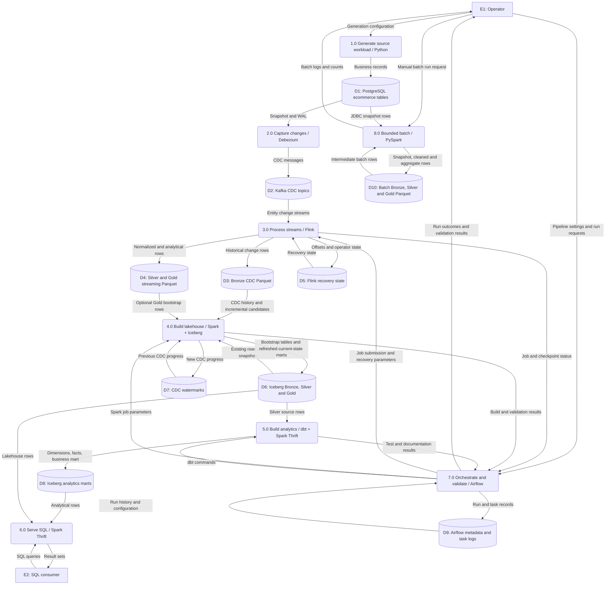
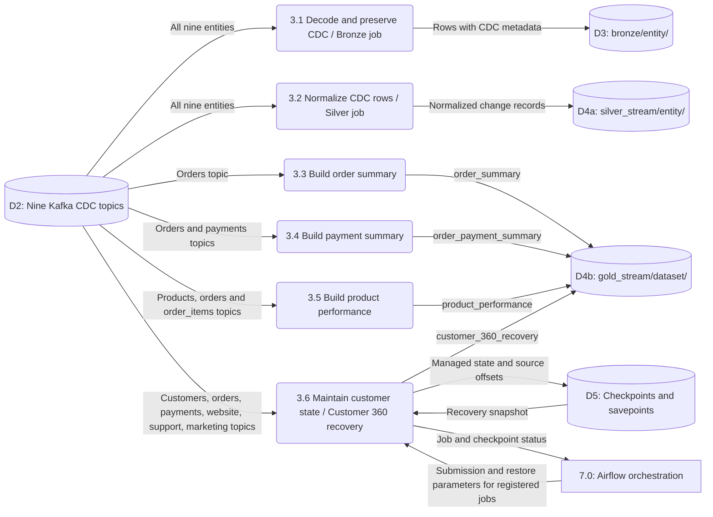
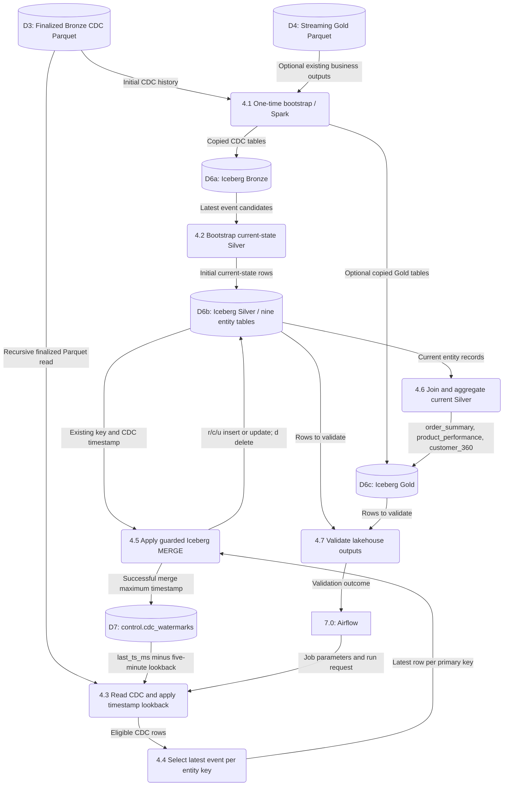
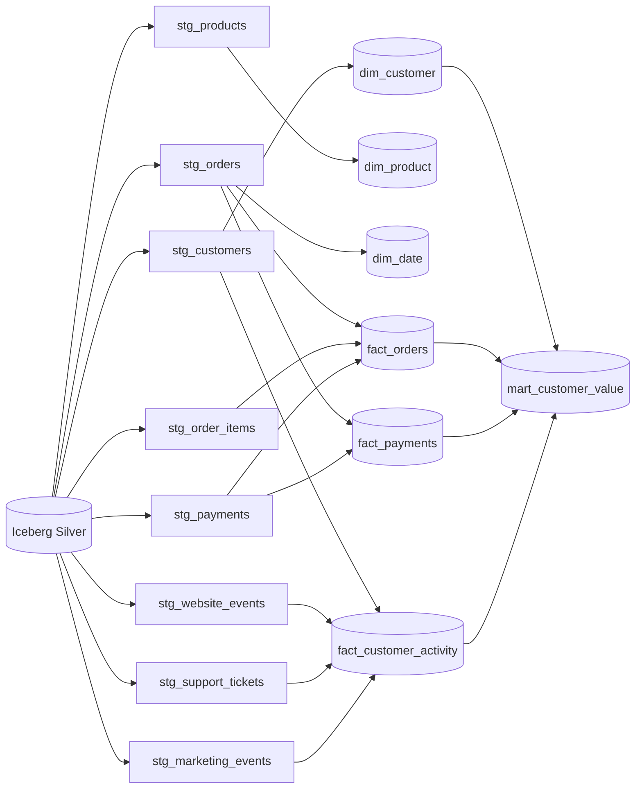
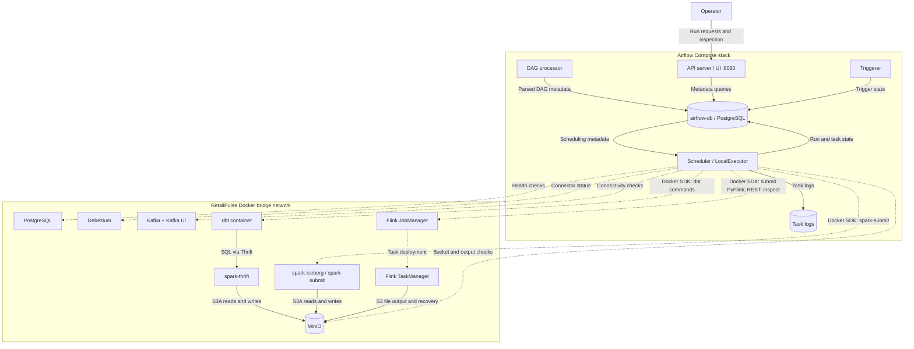
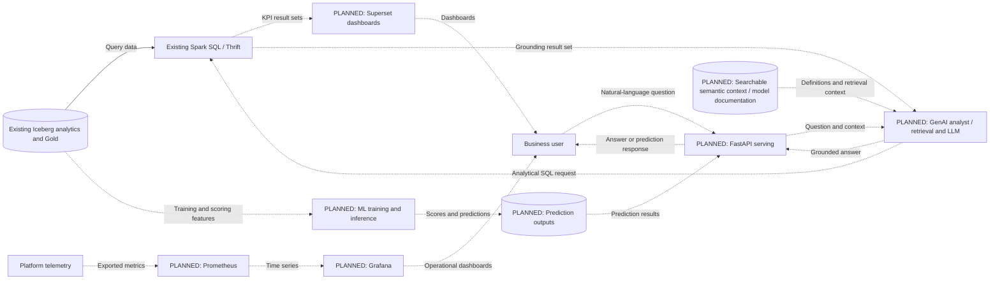

# RetailPulse AI — SRS architecture and data flow diagrams

Version 1.0 | Repository baseline: 11 September 2026

## 1. Scope and notation

This document describes the implementation present in the repository and a separately identified target extension for BI, ML, and GenAI. “Implemented” means code/configuration exists; it does not assert that services are currently running or that end-to-end acceptance tests passed.

The system boundary includes the generator, operational database, ingestion, processing, storage, analytics, and orchestration. External actors are the operator and analytics consumer. Real storefront/customer integrations are future source systems; the current source workload is generated in Python.

In architecture diagrams, solid arrows carry data or query results, and dotted arrows carry control or explicitly labeled planned flows. In DFDs, rectangles are external entities, rounded nodes are numbered processes, cylinders are logical stores, and all arrows identify information being transferred. These are Mermaid representations of DFD notation, rather than strict graphical Yourdon symbols. Stores shown separately can share the same physical MinIO instance.

## 2. Layered implementation architecture

All Iceberg table data and Hadoop catalog metadata live under `s3a://retailpulse/warehouse` in MinIO. Iceberg is a table format/catalog integration, not a separate database server. Spark Thrift executes SQL; dbt compiles transformations and issues SQL through that service. The profile selects `analytics`, and model custom schemas also specify `analytics`; standard dbt schema generation can therefore resolve marts to `analytics_analytics`. Confirm the resolved schema in compiled artifacts before documenting a deployed SQL name.

The diagram above covers the recurring data path. The bootstrap and older bounded batch path are shown separately below because their storage and scheduling semantics differ.

## 3. DFD Level 0 — system context

The SQL consumer is an interface role; a dedicated dashboard application is not yet configured. Generation happens inside this boundary, so no external production storefront is implied.

## 4. DFD Level 1 — major processes and stores

D10's Bronze prefix physically overlaps D3 in the current implementation. They are distinct logical datasets, not isolated physical locations. See the implementation constraints in section 12.

## 5. DFD Level 2 — streaming process 3.0

The six registered jobs are defined in `airflow/include/retailpulse/jobs.py`. Bronze, Silver, and Gold are output classifications: the active Silver job does not read Bronze files, and the active Gold jobs do not read Silver files. Their topic subscriptions are independent. Streaming files contain emitted records; they should not automatically be interpreted as one current row per business key.

## 6. DFD Level 2 — lakehouse process 4.0

The recurring job reads MinIO Bronze files directly; it does not continuously refresh Iceberg Bronze first. It orders candidates by `_ts_ms`, then `_ingested_at` when available. Updates and deletes require an incoming timestamp at least as new as the existing Silver row. Watermarks advance after the entity merge succeeds. Gold tables are rebuilt with `createOrReplace`, rather than incrementally merged.

## 7. dbt analytical lineage

Arrows here are dbt model dependencies. All eight staging models are ephemeral SQL, not stored staging tables. Inventory is declared as a ninth Silver source but currently has no staging model or downstream mart dependency.

| Analytical object | Grain | Main information |
|---|---|---|
| `dim_customer` | One customer | Identity, location, source segment |
| `dim_product` | One product | Catalog, pricing, margin, inventory quantity |
| `dim_date` | One date over the order-date range | Calendar attributes |
| `fact_orders` | One order | Items, order value, payments, reconciliation |
| `fact_payments` | One payment | Amount, payment status, associated order |
| `fact_customer_activity` | One customer | Website, sessions, support and marketing aggregates |
| `mart_customer_value` | One customer | Lifetime order value, payments, activity, value segment |

The current schema has customer/date relationships for order analytics; there is no materialized order-line fact connecting `dim_product` to `fact_orders`. Customer value segmentation is SQL business logic, not a trained ML prediction.

## 8. Bounded batch flow

```mermaid
flowchart LR
  PG[("PostgreSQL ecommerce tables")]
  EX["PySpark JDBC extraction"]
  B[("MinIO bronze/entity / snapshot Parquet")]
  CL["PySpark Bronze-to-Silver cleanup"]
  S[("MinIO silver/entity / Parquet")]
  AG["PySpark Silver-to-Gold aggregation"]
  G[("MinIO gold/dataset / Parquet")]
  PG -->|"JDBC table snapshots"| EX
  EX -->|"Overwrite with ingestion timestamp"| B
  B -->|"Raw snapshot rows"| CL
  CL -->|"Cleaned rows"| S
  S -->|"Business entities"| AG
  AG -->|"Business aggregates"| G
```

These modules live under `spark/jobs/batch/` and are manually invoked in the runbook. They are separate from the Spark jobs under `lakehouse/iceberg/jobs/` that Airflow submits.

## 9. Tools and interfaces at each layer

| Layer | Tools configured in repository | Input → output | Interface / persistence |
|---|---|---|---|
| Source simulation | Python, generator modules | Generation settings → synthetic retail records | PostgreSQL client, SQL inserts |
| Operational storage | PostgreSQL 16 | Transactions → relational rows and WAL | SQL/JDBC, port 5432; `postgres_data` |
| CDC | Debezium 3.3.2, Kafka Connect, PostgreSQL connector | Snapshot/WAL → CDC envelopes | Connect REST 8083; Kafka internal config/offset/status topics |
| Event transport | Kafka 4.0.1, KRaft | CDC messages → independent consumer streams | Container 9092, host 9094; three partitions/topic, replication factor one |
| Streaming | Flink 2.1.0, Java 17, PyFlink DataStream/Table APIs | Kafka events → Bronze/Silver/Gold records | JobManager/TaskManager; REST/UI 8081 |
| Object lake | MinIO, Parquet | File sinks → persisted datasets | S3 API 9000, console 9001; `minio_data` |
| Bounded batch | Spark 4.0.1 / PySpark, PostgreSQL JDBC | Database snapshot → Bronze → Silver → Gold | JDBC and Hadoop S3A |
| Lakehouse | Spark, Iceberg 1.11.0 setting, Hadoop catalog | CDC files → current-state Silver and Gold tables | `s3a://retailpulse/warehouse`; data and metadata in MinIO |
| SQL execution | Spark Thrift Server, Iceberg extensions | SQL → reads, writes and result sets | Thrift port 10000 |
| Analytics modeling | dbt Core, dbt-spark, SQL, Jinja | Silver → eight staging expressions → seven marts | Thrift adapter; Iceberg table materialization |
| Data quality | dbt tests, Spark validation scripts, Airflow checks | Sources/models/service state → pass/fail and logs | Uniqueness, nullability, relationships, amounts, CDC timestamps |
| Orchestration | Airflow 3.3.1, LocalExecutor, Python Docker SDK | Schedules/run requests → submitted jobs and status | UI host 8090; local Docker socket, REST, S3 checks |
| Orchestration state | Separate PostgreSQL 16 `airflow-db` | Task/run metadata → persisted orchestration history | Internal Airflow network; log mount |
| Inspection | Kafka UI, Flink UI, MinIO console, Airflow UI | Platform metadata → operator views | Host ports 8080, 8081, 9001, 8090 |
| Packaging | Docker, Docker Compose, Python requirements | Images/configuration → local services | RetailPulse bridge network plus Airflow internal network |
| Future consumption | Superset, FastAPI, ML, RAG/LLM, Prometheus/Grafana | Planned analytics/telemetry → dashboards, predictions, answers | No implemented end-to-end serving flow found |

Versions above are repository declarations, not a claim about the latest upstream releases or a running deployment.

## 10. Entity and storage dictionary

For every entity below, the operational source is `ecommerce.<entity>`, its Kafka topic is `retailpulse.ecommerce.<entity>`, its CDC landing path is `s3://retailpulse/bronze/<entity>/`, and its current-state Iceberg table is `retailpulse.silver.<entity>`.

| Entity | Primary key | Business content |
|---|---|---|
| customers | customer_id | Identity, contact, geography, customer segment |
| products | product_id | Catalog, price, cost and inventory quantity |
| orders | order_id | Customer purchases, status and totals |
| order_items | order_item_id | Product quantities, unit prices and discounts |
| payments | payment_id | Order/customer payments and payment status |
| inventory | inventory_id | Inventory records |
| website_events | event_id | Customer browsing and session events |
| support_tickets | ticket_id | Customer support cases |
| marketing_events | marketing_event_id | Impressions, clicks, conversions and cost |

| Store | Location / content |
|---|---|
| Streaming Silver | `s3://retailpulse/silver_stream/<entity>/` |
| Streaming Gold | `gold_stream/order_summary/`, `order_payment_summary/`, `product_performance/`, `customer_360_recovery/` in the retailpulse bucket |
| Customer 360 recovery | `flink-checkpoints/customer360-recovery/` and `flink-savepoints/customer360-recovery/` |
| Default Flink recovery | Shared Docker volume mounted at `/tmp/flink-checkpoints`; specific jobs override storage |
| Iceberg Bronze | `retailpulse.bronze.<entity>`; one-time imported CDC history |
| Iceberg Silver | `retailpulse.silver.<entity>`; current entity state |
| Recurring Iceberg Gold | `retailpulse.gold.order_summary`, `.product_performance`, `.customer_360` |
| Optional bootstrap-only Gold | `retailpulse.gold.order_payment_summary` is also importable; the recurring Gold builder does not refresh it |
| Incremental progress | `retailpulse.control.cdc_watermarks`: table_name, last_ts_ms, updated_at |
| Analytics | Seven Iceberg marts; resolve actual namespace from dbt compilation |
| dbt artifacts | `dbt/target/`: compiled SQL, run/manifest and generated documentation artifacts when commands succeed |

## 11. Orchestration and deployment

| DAG | Configured schedule | Workflow |
|---|---|---|
| `retailpulse_platform_health` | Every five minutes | PostgreSQL, Debezium, Kafka, Flink, MinIO health checks |
| `retailpulse_streaming_controller` | Every five minutes | Health checks → ensure registered Flink jobs → Customer 360 checkpoint/output checks |
| `retailpulse_iceberg_pipeline` | Manual | Initial lakehouse/bootstrap and Silver validation workflow |
| `retailpulse_iceberg_incremental` | Every five minutes | Flink/MinIO health → CDC MERGE → Gold rebuild → validation |
| `retailpulse_iceberg_maintenance` | Daily 02:00 UTC | Rewrite data files and manifests for configured Silver/Gold tables |
| `retailpulse_dbt_analytics` | Manual | `dbt debug` → `dbt build` → `dbt docs generate` |

Schedules are declarations; actual execution also depends on DAG availability, activation and platform health. The dbt DAG is not currently triggered automatically by completion of the incremental Iceberg DAG. Airflow stores orchestration metadata in its own PostgreSQL instance, separate from retail transactions. The local Docker-socket submission design is the implemented deployment; Kubernetes/Flink Operator is a future migration in the runbook.

## 12. Implementation constraints relevant to the SRS

1. **Shared Bronze destination:** the bounded JDBC extractor overwrites the same `bronze/<entity>` prefixes used by CDC and adds `_ingestion_timestamp`, whereas incremental CDC requires `_op` and `_ts_ms`. These paths must be isolated before treating batch extraction and continuous CDC as safely concurrent workflows.
2. **Separate freshness:** five-minute lakehouse scheduling does not imply five-minute analytics freshness because dbt is manually triggered. Schedule intervals are not measured latency guarantees.
3. **Current-state semantics:** streaming outputs and bootstrap copies are distinct from recurring Iceberg Silver current state. The recurring Gold builder replaces three tables from Silver; bootstrap can import a fourth Gold dataset.
4. **Timestamp replay limits:** the incremental job has a five-minute timestamp lookback, not an unlimited late-event guarantee. Physical deletes do not retain a persistent per-key tombstone/version ledger, so replay correctness after deletes requires additional acceptance testing.
5. **Schema resolution:** the dbt profile and custom model schema can combine into `analytics_analytics`. The intended `analytics` name should be reconciled with compiled/deployed relations.
6. **Quality scope:** existing tests and validation are present, but no dedicated quarantine/DLQ flow, universal quality gate before every write, or measured SLO is established here.
7. **Maintenance scope:** the maintenance script rewrites data files/manifests for configured Silver and Gold tables; it does not currently cover dbt analytics tables or implement snapshot expiry.
8. **Deployment scope:** this is a local Compose topology with one Kafka broker and replication factor one. The document does not claim production high availability or a deployed BI/AI service.

## 13. Target extension — planned BI, ML and GenAI

This is a proposed completion of the project vision in the README. Dotted arrows below are planned integrations, and the serving/ML tools and contracts still require implementation decisions.

## 14. Repository traceability

| Diagram / concern | Implementation evidence |
|---|---|
| Service topology and ports | [Root Compose](../../docker-compose.yml), [Airflow Compose](../../airflow/docker-compose.airflow.yml) |
| Source workload | [Generator](../../data_generator/main.py), [DDL](../../sql/02_create_tables.sql) |
| Active stream membership | [Flink job registry](../../airflow/include/retailpulse/jobs.py) |
| Streaming transformations | [Bronze](../../flink/jobs/streaming/bronze/retailpulse_bronze.py), [Silver](../../flink/jobs/streaming/silver/retailpulse_streaming_silver.py), [Gold directory](../../flink/jobs/streaming/gold/) |
| Batch flow | [Batch modules](../../spark/jobs/batch/) |
| Iceberg catalog and bootstrap | [Session](../../lakehouse/iceberg/jobs/iceberg_session.py), [Bootstrap](../../lakehouse/iceberg/jobs/bootstrap_minio_to_iceberg.py) |
| Incremental merge | [CDC to Silver](../../lakehouse/iceberg/jobs/incremental_cdc_to_silver.py) |
| Iceberg business tables | [Gold builder](../../lakehouse/iceberg/jobs/build_gold_marts.py) |
| Analytics source and output definitions | [Sources](../../dbt/models/sources.yml), [Project](../../dbt/dbt_project.yml), [Profile](../../dbt/profiles.yml), [Models](../../dbt/models/) |
| Orchestration schedules | [DAGs](../../airflow/dags/) |
| Data quality | [dbt tests](../../dbt/tests/), [Model tests](../../dbt/models/marts/schema.yml), [Iceberg validation](../../lakehouse/iceberg/jobs/validate_incremental_pipeline.py) |

The older README phase labels lag behind the current implementation. This document gives precedence to active job registrations, DAGs, model SQL and Compose configuration.
